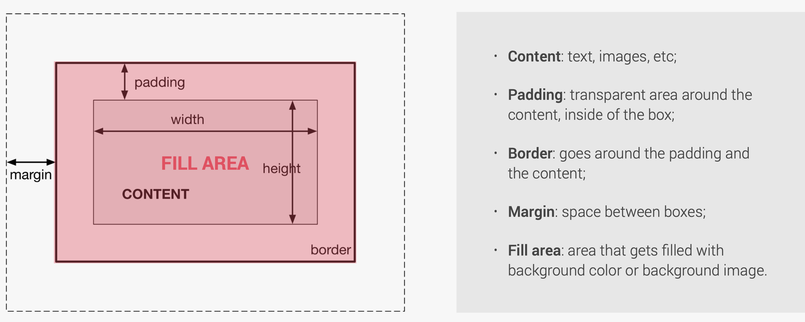
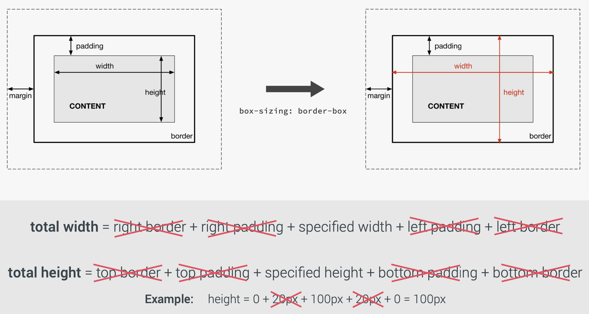

# CSS: Box Model and Display Property

## Box Model

### Boxing Sizing



**Fill area** is the area that gets filled with background color or background image, it includes content area, padding and border.

The CSS `box-sizing` property allows us to include the padding and border in an element's total width and height.

#### Content Box

The content-box value is the default value, leaving the box model as an additive design.

#### Border Box

The `border-box` value alters the box model so that any **border or padding** property values are included within the _width_ and _height_ of an element.
For example, to keep the width at 300px, no matter the amount of padding, you can use the `box-sizing` property. This causes the element to maintain its width; if you increase the padding, the available content space will decrease:

#### Padding Box

The `padding-box` value alters the box model by including any **padding** property values within the _width_ and _height_ of an element.

The total width of an element with `display: box` (content box vs border box):



---

### Margin Collapse

If the bottom margin of any box touches the top margin of another, the browser will render it differently than you might expect. It will only show the larger of the two margins. If both margins are the same size, it will only show one. (https://stackoverflow.com/questions/19718634/how-to-disable-margin-collapsing#:~:text=%20There%20are%20two%20main%20types%20of%20margin,margins%20between%20parent%20and%20child%20elements%20More%20)

### Negative Value

If you set an element's margin to a **negative value**, the element will grow larger.

==Note:==
**The value of border, margin and padding property is not inherited by child elements** in the same way that the color value of the font-family property is; so you need to specify the padding for every element that needs to use it.

<br>

### Borders

The border property requires three values: **_width, style, and color_**. Shorthand values for the border property are stated in that order. In longhand, these three values can be broken up into the border-width, border-style, and border-color properties.

#### Border Styles

The `border-style` property specifies what kind of border to display:

- _dotted_
- _dashed_
- _solid_
- _double_
- _groove_: defines a 3D grooved border. The effect depends on the border-color value
- _ridge_: defines a 3D ridged border. The effect depends on the border-color value
- _inset_: defines a 3D inset border. The effect depends on the border-color value
- _outset_: defines a 3D outset border. The effect depends on the border-color value
- _none_: defines no border
- _hidden_: defines a hidden border

The border-style property can have from one to four values (for the top, right, bottom and left border)

```

p.mix {border-style: dotted dashed solid double;}

```


==Note:== NONE of the OTHER CSS border properties will have ANY effect unless the `border-style` property is set!

#### Border Width

The `border-width` can be set as a specific size (in px, cm, em, etc) or by using one of the three pre-defined values: _thin, medium, or thick_. The `border-width` property can have from one to four values. (==Note:== You cannot use percentages with this property.)
You can control the individual size of borders using four separate properties: **border-top-width, border-right-width, border-bottom-width, border-left-width**. You can also specify different widths for the four border values in one property, like so:
`border-width: 2px 1px 1px 2px;`.

#### Border Color

The `border-color` property can be set by keyword colors, HEX, RGB, HSL or transparent. If `border-color` is not set, it inherits the color of the element.

#### Border Image

The `border-image` CSS property draws an image around a given element. It replaces the element's regular border. **You need to specify `border-width` and `border-style` first for the border image to be rendered**. This property is a shorthand for the following CSS properties:

1. `border-image-source`
2. `border-image-slice`: divides the image specified by border-image-source into nine regions. It may be specified as one, two, three, or four values. When four values are specified, they create slices measured from the top, right, bottom, and left in that order (clockwise).
   
   - Zones 1-4 are <i><u>corner regions</u></i>. Each one is used **a single time** to form the corners of the final border image.
   - Zones 5-8 are <i><u>edge regions</u></i>. These are **repeated, scaled, or otherwise modified** in the final border image to match the dimensions of the element.
   - Zone 9 is the middle region. It is discarded by default, but is used like a background image if the keyword **fill** is set.
3. `border-image-width`: sets the width of an element's border image. It may be specified as one, two, three, or four values.
4. `border-image-outset`: sets the distance by which an element's border image is set out from its border box. It may be specified as one, two, three, or four values.
5. `border-image-repeat`: defines how the <u><i>edge regions</i></u> of a source image are adjusted to fit the dimensions of an element's border image. It may be specified using _one or two_ values.
   - stretch: The source image's edge regions are stretched to fill the gap between each border.
   - repeat: The source image's edge regions are tiled (repeated) to fill the gap between each border. Tiles may be clipped to achieve the proper fit.
   - round: The source image's edge regions are tiled (repeated) to fill the gap between each border. Tiles may be stretched to achieve the proper fit.
   - space: The source image's edge regions are tiled (repeated) to fill the gap between each border. Extra space will be distributed in between tiles to achieve the proper fit.

Example:
Use the followingi image (81px &times;81px) as border image:


```html
<style type="text/css">
  p.one {
    display: inline-block;
    width: 100px;
    height: 50px;
    border-width: 10px;
    border-style: solid;
    border-image: url("https://s2.loli.net/2021/12/17/YVIxGCF8DZ6LKmu.png") 27
      27 27 27 stretch;
  }
  p.two {
    display: inline-block;
    width: 100px;
    height: 50px;
    border-width: 10px;
    border-style: dotted;
    border-image: url("https://s2.loli.net/2021/12/17/YVIxGCF8DZ6LKmu.png") 27
      27 27 27 round;
  }
  p.three {
    display: inline-block;
    width: 100px;
    height: 50px;
    border-width: 10px;
    border-style: double;
    border-image: url("https://s2.loli.net/2021/12/17/YVIxGCF8DZ6LKmu.png") 27
      27 27 27 space;
  }
</style>

<p class="one"></p>
<p class="two"></p>
<p class="three"></p>
```

<style type="text/css">
  p.one {
    display: inline-block;
    width: 100px;
    height: 50px;
    border-width: 10px;
    border-style: solid;
    border-image: url("https://s2.loli.net/2021/12/17/YVIxGCF8DZ6LKmu.png") 27 27 27 27 stretch;}
  p.two {
    display: inline-block;
    width: 100px;
    height: 50px;
    border-width: 10px;
    border-style: dotted;
    border-image: url("https://s2.loli.net/2021/12/17/YVIxGCF8DZ6LKmu.png") 27 27 27 27 round;}
  p.three {
    display: inline-block;
    width: 100px;
    height: 50px;
    border-width: 10px;
    border-style: double;
    border-image: url("https://s2.loli.net/2021/12/17/YVIxGCF8DZ6LKmu.png") 27  space;}
</style>

<p class="one"></p>
<p class="two"></p>
<p class="three"></p>

#### Border Radius

A single value will round all four corners of an element equally; two values will round the _top-left/bottom-right_ and _top-right/bottom-left_ corners in that order; four values will round the _top-left_, _top-right_, _bottom-right_, and _bottom-left_ corners in that order.
The `border-radius` property may also be broken out into longhand properties that allow us to change the radii of individual corners of an element. These longhand properties begin with border, continue with the corner’s vertical location (top or bottom) and the corner’s horizontal location (left or right), and then end with radius.

```
 div {
 border-top-right-radius: 5px;
 }
```

##### Elliptical Shapes

To create more complex shapes, you can specify different distances for the horizontal and the vertical parts of the rounded corners.
Example:

```
border-top-right-radius: 80px 50px;
```


There is also a shorthand for targetting all four corners at once; first you specify the four horizontal values, then the four vertical values.

```html
<style type="text/css">
  p.rad{
    border: 10px solid pink;
    width: 100px;
    height: 50px;
    border-radius: 1em 4em 1em 4em / 2em 1em 2em 1em;
</style>

<p class="rad"></p>
```

<style type="text/css">
  p.rad{
    border: 10px solid pink;
    width: 100px;
    height: 50px;
    border-radius: 1em 4em 1em 4em / 2em 1em 2em 1em;
</style>

<p class="rad"></p>
