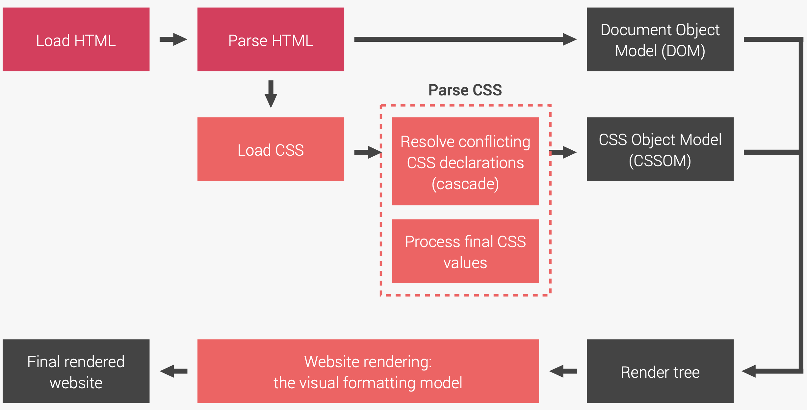
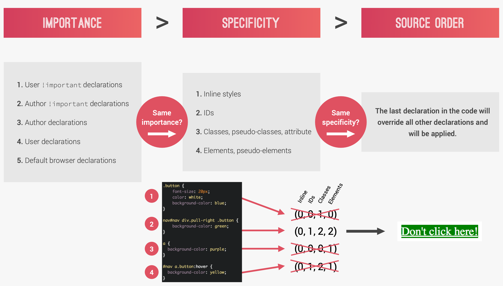
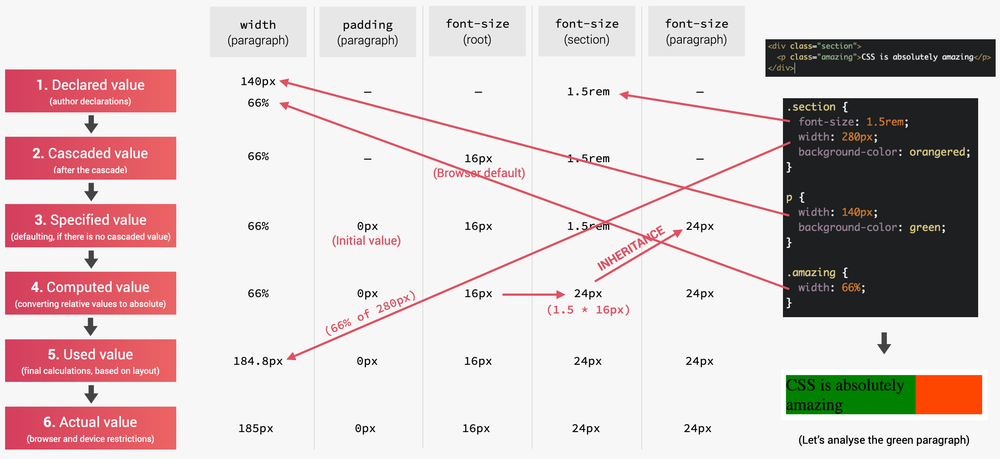
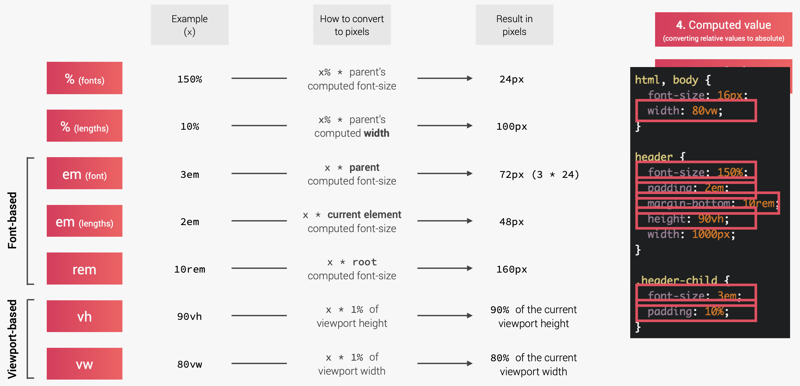

# How CSS works behind the scene

## What happens to css when we load up a webpage



## The cascade

The `type` selector has the lowest specificity weight and holds a point value of _0-0-1_. The `class` selector has a medium specificity weight and holds a point value of _0-1-0_. Lastly, the `id` selector has a high specificity weight and holds a point value of _1-0-0_.

🟡 Note: attribute selectors like `[type="radio"]` and `[lang|="fr"]`, and pseudo-classes, such as `:hover`, `:nth-of-type(3n)`, and `:required` are **class selectors**.



### Basic rules:

- CSS declarations marked with `!important` have the highest priority;
  But, only use `!important` as a last resource. It’s better to use correct specificities — more maintainable code!
- Inline styles will always have priority over styles in external stylesheets;
- A selector that contains 1 ID is more specific than one with 1000 classes;
- A selector that contains 1 class is more specific than one with 1000 elements;
- The universal selector `*` has no specificity value (0, 0, 0, 0);
- Rely more on specificity than on the order of selectors;
- But, rely on order when using 3rd-party stylesheets — always put your author stylesheet last.

### Example:

```html
<nav id="nav">
  <div class="pull-right">
    <a class="button button-danger">Don't click</a>
  </div>
</nav>
```

```css
.button {
  font-size: 20px;
  color: white;
  background-color: blue;
}

#nav div.pull-right a.button {
  background-color: orangered;
}

#nav a.button:hover {
  background-color: yellow;
}
```

The button is rendered orangered. However, when we hover over the button, its background color doesn't change. This is because `#nav div.pull-right a.button` have higher specificity over `#nav a.button:hover` (1,2,2 over 1,2,1). If we want it to be yellow, then we need a selector with an even higher specificity then not hovered.

### Layering Styles with Multiple Classes

One way to keep the specificity weights of our selectors low is to be as modular as possible, sharing similar styles from element to element. Elements within HTML can have **more than one class attribute value** so long as each value is space separated. We can tie styles we want to continually reuse to one class and layer on additional styles from another class.

```html
<a class="btn btn-danger">...</a>

<a class="btn btn-success">...</a>
```

```css
.btn {
  font-size: 16px;
}
.btn-danger {
  background: red;
}
.btn-success {
  background: green;
}
```

<hr>

## How css values are processed





🟡 Note:

- Percentage and `em` are calculated differently when used for font and length
- Each property has an initial value, used if nothing is declared (and if there is no inheritance)
- **Browsers** (user agent) specify a root font-size for each page (usually 16px)

## Inheritance

Inheritance: inherit the computed value of parent element. Example:

```css
.parent {
  font-size: 20px;
  line-height: 150%;
}

.child {
  font-size: 25px;
}
```

Here in this case, the line-height of child element is not 150%, but the computed value of 150%, which is `20px * 150% = 30px` (line-height is calculated relative to the current element's font-size, an exception to the rules above)

The `inherit` keyword forces inheritance on a certain property; the `initial` keyword resets a property to its initial value.
