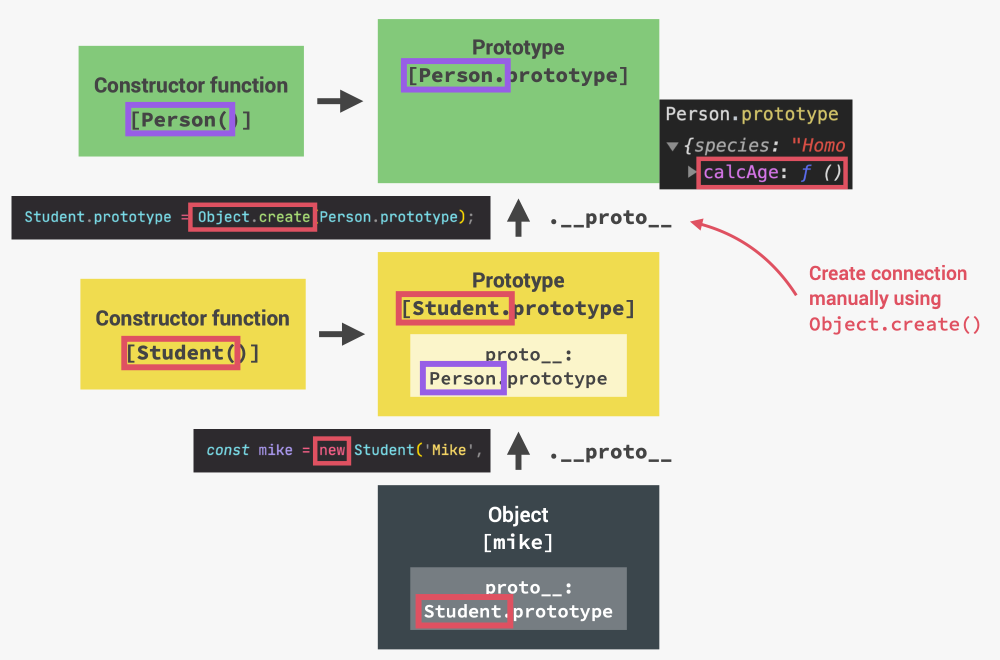

# Inheritance

## Using constructor functions

We have `Person` as parent class and `Student` as child class, but `Person` and `Student` have some duplicate code:

```javascript
const Person = function (firstName, birthYear) {
  this.firstName = firstName;
  this.birthYear = birthYear;
};

const Student = function (firstName, birthYear, course) {
  this.firstName = firstName;
  this.birthYear = birthYear;
  this.course = course;
};
```

We can replace the duplicate code in `Student` with:

```javascript
const Student = function (firstName, birthYear, course) {
  Person.call(this, firstName, birthYear);
  // Person as a function call
  this.course = course;
};

Student.prototype = Object.create(Person.prototype);
Student.prototype.introduce = function () {
  console.log(`My name is ${this.firstName} and I study ${this.course}`);
};

const mike = new Student("mike", 1999, "cs");
```

1. Why do we need to use `.call()` method?

> If we use `Person(firstName, birthYear)`, without `new`, it's a regular function call, and `this` keyword in a function call is `undefined`.

2. prototype property of `Student` inherits from the prototype property of `Person`:

```javascript
Student.prototype.__proto__ === Person.prototype; // true
```

> - This should be added **before** all `student.prototype.someMethods`, because `Object.create` will return an empty object. Onto that empty object, we can add methods.
> - Why not use `Student.prototype = Person.prototype;`?
>   In this way, `Studnet.prototype` and `Person.prototype` would be the exact same object.

#### Clearing my thoughts

```javascript
mike.__proto__ === Student.prototype; // true
mike.__proto__.__proto__ === Person.prototype; //true
mike.constructor === Student; // false
mike.constructor === Person; // true
Student.prototype.constructor === Person; // true
```

When manually setting the prototype to a new object, it erases the constructor property, and we should remember to define the constructor property:

```javascript
Student.prototype.constructor = Student;
```

Output:

```javascript
mike.constructor === Student; // true
```



## Using ES6 classes (`extends` and `super`)

```javascript
class PersonCL {
  constructor(firstName, birthYear) {
    this.firstName = firstName;
    this.birthYear = birthYear;
  }
  calcAge = function () {
    console.log(2030 - this.birthYear);
  };
}

class StudentCL extends PersonCL {
  // This will link the prototype behind the scenes
  constructor(firstName, birthYear, course) {
    super(firstName, birthYear);
    this.course = course;
  }
}
```

> - `super` function works like the constructor function of parent class
> - It needs to be put before `this` keyword, because the `super` function is responsible for creating `this` keyword in the subclass

If we don't need any new parameters in the new class, we don't need to use constructor and super.

```javascript
class StudentCL extends PersonCL {}
const martha = new StudentCL("martha jones", 1999);
```

We can override methods in parent class by adding new methods with the same name in child class.

## Using Object.create()

```javascript
const PersonProto = {
  calcAge() {
    console.log(2030 - this.birthYear);
  },

  init(firstName, birthYear) {
    this.firstName = firstName;
    this.birthYear = birthYear;
  },
};

const StudentProto = Object.create(PersonProto);
StudentProto.init = function (firstName, birthYear, course) {
  PersonProto.init.call(this, firstName, birthYear);
  this.course = course;
};
StudentProto.introduce = function () {
  console.log(`My name is ${this.name}and I'm studying ${this.course}`);
};

const jay = Object.create(StudentProto);
jay.init("jay chow", 1998, "cs");
```

Here, `PersonProto` is the prototype of `StudentProto`, and `StudentProto` is the prototype of `jay`.
