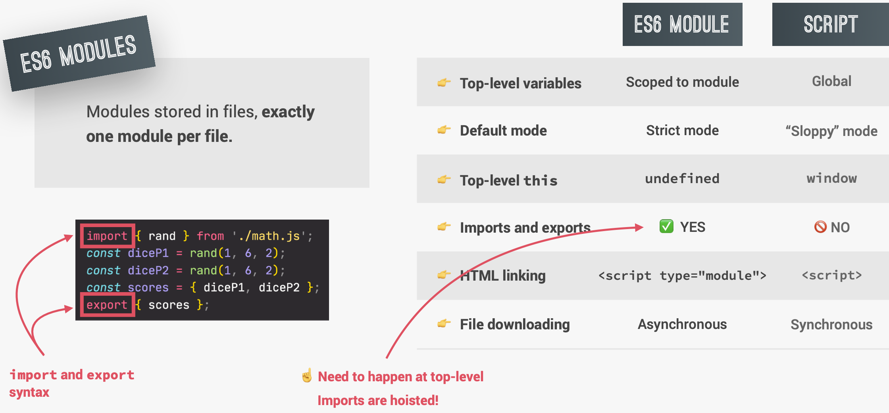

# Modules

- We can export values out of a module, and these values are called the **public API**. This public API is consumed by importing values into a module.
- The modules from which we import are called **dependencies** of the imported module.

As of ES6, JavaScript has a native built-in module system. ES6 modules are modules that are actually stored in files and **each file is one module**.



🟡 Note:

1. `export` and `import` can only happen _at the top level_, which means they can only happen at the top level, outside any function or block.
2. Imports are hoisted:
   Only after all imported modules have been downloaded and executed, the main js module will be executed. Modules are imported **synchronously**.
3. After the parsing process, it has figured out which modules needs to import, then these modules are actually downloaded from the server. Downloading happens in an **asynchronous** way.
4. Exported values are not copied to imports. Instead, the import is basically just **a reference to** the exported value, like a pointer. (live connection)
   

## Exporting and importing in ES6 modules

### Import a module without importing any value

```javascript
// shoppingCart.js
console.log("Exporting module");

// script.js
console.log("Importing module");
import "./shoppingCart.js";

// Output
Exporting module
Importing module
```

==Note:==

1. All imported statements are hoisted to the top.
2. We don't need to use strict mode here, because all modules are executed in strict mode by default.

### Named export

```javascript
// shoppingCart.js
console.log("Exporting module");

const shippingCost = 10;
const cart = [];

export const addToCart = function (product, quantity) {
  cart.push({ product, quantity });
  console.log(`${quantity} ${product} added to cart`);
};

// script.js
console.log('Importing module');
import { addToCart } from './shoppingCart.js';

addToCart('apple', 5);

// Output
Exporting module
script.js:1 Importing module
shoppingCart.js:8 5 apple added to cart
```

#### Export multiple things

```javascript
// shoppingCart.js
const totalPrice = 234;
const totalQuantity = 44;

export { totalPrice, totalQuantity };

// script.js
import { totalPrice, totalQuantity } from './shoppingCart.js';
console.log(totalPrice, totalQuantity);

// Output
234 44
```

We can change the name of the imported values as well:

```javascript
// script.js
import { totalPrice as tp, totalQuantity as tq } from "./shoppingCart.js";
console.log(tp, tq);
```

We can also change name in the exports:

```javascript
// shoppingCart.js
export { totalPrice as tp, totalQuantity as tq };

// script.js
import { tp, tq } from "./shoppingCart.js";
console.log(tp, tq);
```

We can import all the exports of a module. Here, `ShoppingCart` acts like namespace:

```javascript
// shoppingCart.js
export const addToCart = function (product, quantity) {
  cart.push({ product, quantity });
  console.log(`${quantity} ${product} added to cart`);
};

const totalPrice = 234;
const totalQuantity = 44;

export { totalPrice as tp, totalQuantity as tq };

// script.js
import * as ShoppingCart from "./shoppingCart.js";
ShoppingCart.addToCart("orange", 4);

// Output
4 orange added to cart
```

### Default export

Usually, we use default exports when we only want to export one thing per module. Take note that there is no name involved in the export, and when we import it, we can give it any name we want. Here we _don't need curly braces_.

```javascript
// shoppingCart.js
export default function (product, quantity) {
  cart.push({ product, quantity });
  console.log(`${quantity} ${product} added to cart`);
}

// script.js
import add from "./shoppingCart.js";
add("pear", 2);
```

## Module pattern

_Old way_ of implementing modules and encapsulating code: using functions (IIFE). The only purpose of this function is to create a new scope and return data just once.

```javascript
const ShoppingCart = (function () {
  const shippingCost = 10;
  const cart = [];
  const totalPrice = 234;
  const totalQuantity = 44;

  const addToCart = function (product, quantity) {
    cart.push({ product, quantity });
    console.log(`${quantity} ${product} added to cart`);
  };

  return { cart, totalPrice, totalQuantity, addToCart };
})();

ShoppingCart.addToCart("apple", 4);
console.log(ShoppingCart);

// Output:
4 apple added to cart
script.js:43 {cart: Array(1), totalPrice: 234, totalQuantity: 44, addToCart: ƒ}
```

We are able to manipulate the data inside of ShoppingCart because of **closure**.

### commonJS module

It is another module system besides native ES modules, and is used in node.js, doesn't work on browsers.

```javascript
// Export
export.addToCart = function (product, quantity) {
  cart.push({ product, quantity });
  console.log(`${quantity} ${product} added to cart`);
};

// Import
const { addToCart } = require('./shoppingCart.js');
```
