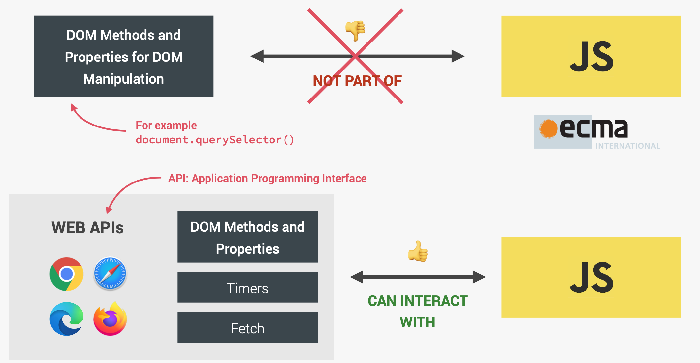
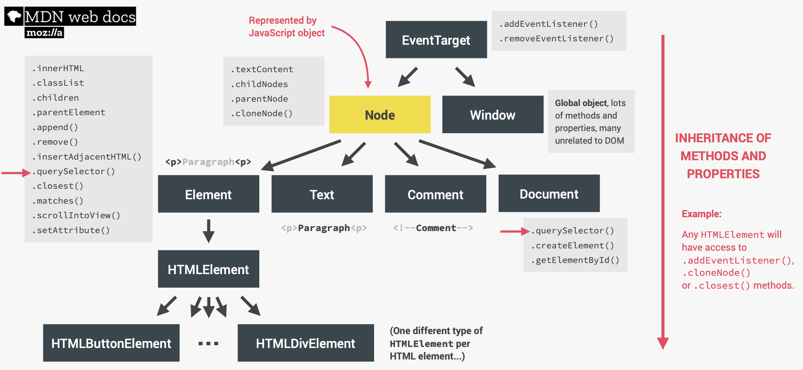

## The DOM

The DOM is the interface between all JavaScript code and the browser. DOM tree is a tree structure generated from an HTML document by browser on load. DOM methods and properties are not part of JavaScript. They belong to web APIs.



DOM tree has different types of nodes. Every node type can inherit from its parent node types. For instance, we can use `addEventListener` on an element because there is a special node type called `EventTarget` which is a parent of both the node type and also the window node type.



## Element selector

### Special elements

Special elements don't need to use any selector:

- document element: `document.documentElement`
- head: `document.head`
- body: `document.body`

### getElementBy...

`getElementBy` returns an **HTML collection**. It is a **live collection**, which means that ❗️if the DOM changes, then this collection is also immediately updated automatically❗️.

- `.getElementsByTagName()` search for specific tag name like `<li>`
- `getElementsByClassName()` search for specific class name, e.g. `document.getElementByClassName("btn");`, return an array;
- `getElementById()` return a single item. e.g. select an element with id = "title" and change inner text to goodbye: `document.getElementById("title").innerHTML = "goodbye";`

### querySelector

- element: `document.querySelector("l1");`,
- class: `document.querySelector(".btn");`,
- id: `document.querySelector("#title");`

We can also combine them to create hierarchical selectors.

If more than one element match the selector, only the first one will be returned.

`querySelectorAll` can select all the elements that match the selector, and return an array. This returns a **node list** of all elements selexted by the selector. ❗️A node list will not be updated automatically❗️.

Values are passed in _as strings_ in js: `document.querySelectorAll("button")[2].style.color = "red";`

🟡 Note: these selectors can also be used on elements other than `document`, so that we can select their children or descendant elements.

---

## Manipulating elements

### Changing text

- `.innerHTML` or `.textContent`, the former one gives you all that between the html tag, while the latter one only return the text content. So if we also need to change the style of text, we can use `document.querySelector("h1").innerHTML = "<em>goodbye</em>";`
- `.value`: change the value of a text field.

### Creating and removing an element

```js
const elem = document.createElement("div"); // Returns a DOM element, but we still need to insert it to the page

elem.remove();
```

### Inserting HTML elements

- `element.insertAdjacentHTML(position, text)`. _position_ can take four parameters: `beforebegin`, `afterbegin`, `beforeend` and `afterend`.
- `document.createElement()` to create a DOM element
- `.prepend()` to insert something as the first child of an element; `.append` add as last child.
- `.before()` and `.after()`: add a message before or after an element.

==Note:== If we use `prepend` and `append` at the same time, the element will not be both prepended and appended, `append` will only move the element from before to after because a DOM element is unique and can only exist at one place each time.

```js
header.prepend(elem);
header.append(elem);
```

To insert multiple copies of the same element, we first copy the first element and pass in `true`, which means all the child elements will also be copied.

```js
header.append(elem.cloneNode(true));
```

### Changing attributes

`document.querySelector("a").attributes;` will return a list of all the attributes that are currently attached to the html element. We can use `document.querySelector("a").getAttribute("href");` to get the attribute, use `document.querySelector("a").setAttribute("href", "http://abcd.com");` to change the attribute.

### Child & parent node / element

- child nodes: `.childNodes`, returns a **live NodeList** of child nodes of the given element where the first child node is assigned index 0. Child nodes include _elements, text and comments_.
  child elements: to get a collection containing _only elements_, use `.children`.

- First / last child node / element
  First child node: `.firstChild`;
  First child element: `.firstElementChild`.

- Parent node / element:
  parent node: `.parentNode`;
  parent element: `parentElement`.

- Ancestor:
  The `closest()` method traverses the Element and its parents (heading toward the document root) until it finds a node that matches the provided selector string. Will return itself or the matching ancestor. If no such element exists, it returns _null_.

```javascript
h1.closest(".header").color = "red";
```

Set the closest ancestor to h1 element with a class name of header to red. It is extremely useful in **event delegation**.

- Siblings:
  In JavaScript, we can only access direct siblings.
  Sibling nodes: `.nextSibling` and `.previousSibling`;
  Sibling elements: `.nextElementSibling` and `.previousElementSibling`.

To get all the siblings (including itself), get to the parent element and get all its child elements from there:

```javascript
[...h1.parentElement.children].forEach(function (e) {
  if (e !== h1) {
    e.backgroundColor = "red";
  }
});
```

Here, we set the background color of all h1's siblings to red.

---

## addEventListener

In HTML, when the submit button is clicked, the page will reload. We can prevent from submitting by adding:

```javascript
btn.loginIn.addEventListener("click", function (e) {
  e.preventDefault();
});
```

To make the area lose focus, use:

```javascript
inputLogin.blur();
```

### With and without parenthesis

```javascript
document.querySelector("button").addEventListener("click", handleClick);
function handleClick() {
  alert("I got clicked!");
}
```

The alert will appear when the button gets clicked.
However, if we _add parenthesis after the function call_ `document.querySelector("button").addEventListener("click", handleClick());`, the alert will show up when we open the page, because it is a straight up method call, and will call that method straight away when adding the event listener.

Without the parenthesis, it is passing a function as an input so that it can be called at a later time.

We can replace it with an anonymous function:

```javascript
document.querySelector("button").addEventListener("click", function () {
  alert("I got clicked!");
});
```

If you need to pass arguments to a function that is called by an event handler or listener, but cannot add parenthesis, you can wrap the function call in an anonymous function, and the named function that requires the arguments lives inside the anonymous function.

To remove eventListener, `elem.removeEventListener('click', nameOfFunction);`

---

## Lifecycle DOM events

### After HTML is loaded

```js
document.addEventListener("DOMContentLoaded", function (e) {
  console.log("HTML parsed and DOM tree built!");
});
```

### After all resources are loaded

```js
window.addEventListener("loaded", function (e) {
  console.log("Page fully loaded");
});
```

### Before leaving the page

```js
window.addEventListener("beforeunload", function (e) {
  e.preventDefault();
  e.returnValue = "";
});
```
