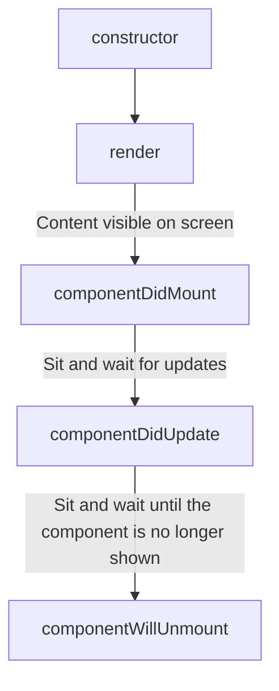

# Basics

- Creating a react file: `npx create-react-app <project name>`
  Since our browser doesn't know how to execute jsx files, create-react-app-dev-server uses **Babel** to turn jsx into normal js code, and uses **webpack** to merge all project files into a single file, usually referred to as `bundle.js`.

- React and React DOM:

  - React: Library that defines what a component is and how multiple components work together
  - ReactDOM: Library that knows how to get a component to show up _in the browser_

- Converting HTML to JSX:
  1.  All prop names follow camelCase
  2.  Number attributes use curly braces
  3.  Boolean 'true' can be written with just the property name. 'False' should be written with curly braces
  4.  The 'class' attribute is written as 'className'
  5.  In-line styles are provided as objects

```js
// 1) Import the React and ReactDOM libraries
import React from "react";
import ReactDOM from "react-dom";

// 2) Get a reference to the div with ID rooot
const el = document.getElementById("root");

// 3) Tell React to take control of that element
const root = ReactDOM.createRoot(el);

// 4) Create a component
function App() {
  return (
    <div className="wrapper">
      <textarea maxLength={3} spellCheck style={{ backgroundColor: "gray" }} />
    </div>
  );
}
// 5) Show the component on the screen
root.render(<App />);
```

**Props:**
System for passing data _from a parent component to a child component_. The goal is to customize or configure a child component.

A component is a **function or class** that produces HTML to show the user (using JSX) and handles feedback from the user (using event handlers).

How react is now:
|**Class** components|**Function** components|
|---|---|
|Can produce JSX to show content to the user|Can produce JSX to show content to the user|
|Can use the Lifecycle Method system to run code as specific points in time|Can use **Hooks** to run code at specific points in time|
|Can use the 'state' system to update content on the screen|Can use **Hooks** to acces state system and update content on screen|

**State:**
State is a JS object that contains data relevant to a component. It is only usable with class components. Updating 'state' on a component causes the component to (almost) **instantly rerender**.

- State must be initialized when a component is created.
- State can **only** be updated using the function 'setState' (we only use direct assignment when initializing state). `setState` function is built into our component automatically by subclassing react component. Whenever we update our state, we are not required to update every property in it. Updating our state is an additive process.

## Lifecycle


