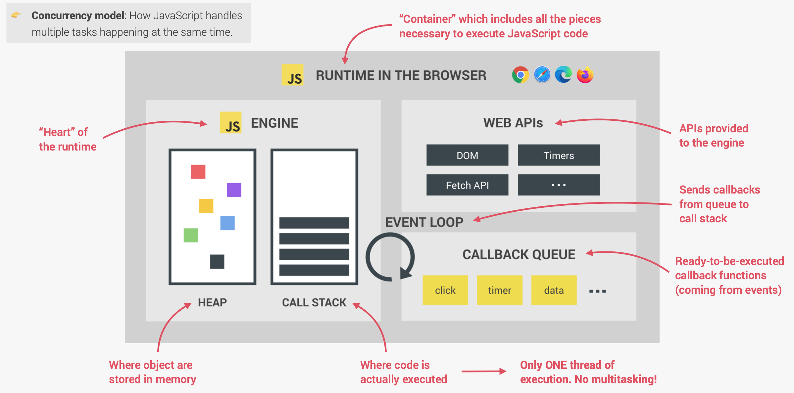
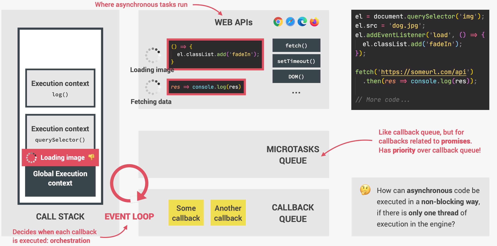

## Consuming a promise

1. Old way of making an AJAX call:

```javascript
const request = new XMLHttpRequest();
request.open("GET", "https://restcountries.com/v3.1/name/united");
request.send();

request.addEventListener("load", function () {
  const data = JSON.parse(this.responseText);
});
```

2. Using FETCH API:

`fetch` will immediately return a Promise

```javascript
const request = fetch("https://restcountries.com/v3.1/name/united");
```

3. To consume a promise:
   (1) use `then` method when it is fulfilled, and the function will receive one argument which is the resulting value of the fulfilled promise:

```javascript
const request = fetch("https://restcountries.com/v3.1/name/united").then(
  function (response) {
    console.log(response);
  }
);
```

In order to look at the data, we need to call the `json` method. But the `json` method itself is also an asynchronous function, and will also return a new promise. So we need to return it and call another `then` method.

```javascript
const request = fetch("https://restcountries.com/v3.1/name/united")
  .then((response) => response.json())
  .then((data) => {
    console.log(data);
  });
```

To add a neighbouring country, we use `fetch` to return a new promise and avoid **callback hell**:

```javascript
const getCountryData = function (country) {
  fetch(`https://restcountries.com/v3.1/name/${country}`)
    .then((response) => response.json())
    .then((data) => {
      renderCountry(data[0]);
      const neighbour = data[0].borders[0];
      if (!neighbourr) return;

      return fetch(`https://restcountries.com/v3.1/alpha${neighbour}"`);
    })
    .then((response) => response.json())
    .then((data) => {
      renderCountry(data, "neighbour");
    });
};
```

(2) Catch error when the first `fetch` method or the second is rejected:

```javascript
const getCountryData = function (country) {
  fetch(`https://restcountries.com/v3.1/name/${country}`)
    .then(
      (response) => response.json(),
      (err) => alert(err)
    )
    .then((data) => {
      renderCountry(data[0]);
      const neighbour = data[0].borders[0];
      if (!neighbourr) return;

      return fetch(`https://restcountries.com/v3.1/alpha${neighbour}"`);
    })
    .then(
      (response) => response.json(),
      (err) => alert(err)
    )
    .then((data) => {
      renderCountry(data, "neighbour");
    });
};
```

But we can also handle the error at the end of the chain by adding a `catch` method. Errors will propogate down the chain until they are caught. An error is actually a javascript object and has `message` property:

```javascript
const renderCountry = function (data, className = "") {
  const html = `
        <article class="country ${className}">
            
            <div class="country__data">
                <h3 class="country__name">${data.name.common}</h3>
                <h4 class="country__region">${data.region}</h4>
                <p class="country__row"><span>👫</span>${(
                  +data.population / 1000000
                ).toFixed(1)}</p>
                <p class="country__row"><span>🗣️</span>${data.languages.eng}</p>
                <p class="country__row"><span>💰</span>${Object.keys(
                  data.currencies
                )}
        </article>`;

  countriesContainer.insertAdjacentHTML("beforeend", html);
  countriesContainer.style.opacity = 1;
};

const renderError = function (err) {
  countriesContainer.insertAdjacentText("beforeend", err);
  countriesContainer.style.opacity = 1;
};

const getCountryData = function (country) {
  fetch(`https://restcountries.com/v3.1/name/${country}`)
    .then((response) => response.json())
    .then((data) => {
      renderCountry(data[0]);
      const neighbour = data[0].borders[0];
      if (!neighbourr) return;

      return fetch(`https://restcountries.com/v3.1/alpha${neighbour}"`);
    })
    .then((response) => response.json())
    .then((data) => {
      renderCountry(data, "neighbour");
    })
    .catch((err) => renderError(`Something went wrong. ${err.message}`));
};
```

(3) `finally` will be executed no matter if the promise is fulfilled or rejected. Since the change of opacity will happen no matter what, it can be put in the `finally` method. Notice that `catch` itself also returns a promise, and that's why `finally` here can work:

```javascript
const renderCountry = function (data, className = "") {
  const html = `
        <article class="country ${className}">
            
            <div class="country__data">
                <h3 class="country__name">${data.name.common}</h3>
                <h4 class="country__region">${data.region}</h4>
                <p class="country__row"><span>👫</span>${(
                  +data.population / 1000000
                ).toFixed(1)}</p>
                <p class="country__row"><span>🗣️</span>${data.languages.eng}</p>
                <p class="country__row"><span>💰</span>${Object.keys(
                  data.currencies
                )}
        </article>`;

  countriesContainer.insertAdjacentHTML("beforeend", html);
};

const renderError = function (err) {
  countriesContainer.insertAdjacentText("beforeend", err);
};

const getCountryData = function (country) {
  fetch(`https://restcountries.com/v3.1/name/${country}`)
    .then((response) => response.json())
    .then((data) => {
      renderCountry(data[0]);
      const neighbour = data[0].borders[0];
      if (!neighbourr) return;

      return fetch(`https://restcountries.com/v3.1/alpha${neighbour}"`);
    })
    .then((response) => response.json())
    .then((data) => {
      renderCountry(data, "neighbour");
    })
    .catch((err) => {
      renderError(`Something went wrong. ${err.message}`);
    })
    .finally(() => {
      countriesContainer.style.opacity = 1;
    });
};
```

3. `fetch` promise only rejects when there's no internet connection. But with status code 404 or 403 error, the `fetch` method will still get fulfilled, so `catch` cannot pick up this error. The response will contain an `ok` property which can be either `true` or `false`, and we can use it to throw new error. This will immediately reject the promise and pass down to `catch` method. This error message will be shown in `err.message`:

```javascript
const getCountryData = function (country) {
  fetch(`https://restcountries.com/v3.1/name/${country}`)
    .then((response) => {
      if (!response.ok) {
        throw new Error(`Country not found (${response.status}). `);
      }
      return response.json();
    })
    .then((data) => {
      renderCountry(data[0]);
      const neighbour = data[0].borders[0];
      if (!neighbourr) return;

      return fetch(`https://restcountries.com/v3.1/alpha${neighbour}"`);
    })
    .then((response) => response.json())
    .then((data) => {
      renderCountry(data, "neighbour");
    })
    .catch((err) => {
      renderError(`Something went wrong. ${err.message}`);
    })
    .finally(() => {
      countriesContainer.style.opacity = 1;
    });
};
```

## Asynchronous way

Since JavaScript only has one thread of execution, asynchronous tasks will run in the **web API environment** of the browser, not in call stack where code is actually executed.

The callback functions will be put into callback queue waiting in line. This means that if we have a function `setTimeout((someFunction), 5000)`, the callback function will be added to callback queue after five minutes. But if there are any other callback functions in the queue, it has to wait for some time. So the timer duration that you define is not a guarantee.


**Event loop:**
Event loop looks into the call stack and determines whether it's empty or not. If the stack is indeed empty, which means that there's currently no code being executed, then it will take the first **callback** from the **callback queue** and put it on the **call stack** two will be executed. This is called an **event loop tick**.

To sum up what happens in the code:

1. The image is loaded asynchronously in the web API environment, not in the call stack. In the meantime, the rest of the code keeps running.
2. The `addEventListener` do not put the callback directly in the callback queue. It simply registers the callback, which then keeps waiting in the web API's environment until the load event is fired off.
3. After the image is loaded, the callback function is put into callback queue.
4. Then in the callback queue, this callback function keeps waiting for the event loop to pick it up and put it on the call stack.
5. The **promise** returned by `fetch` also has callback function, and callbacks returned by promises has a special queue called **microtasks queue**. It has priority over _callback queue_ and will can cut in line before all other regular callbacks.

#### Example 1

```javascript
console.log("Test start");
setTimeout(() => console.log("0 sec timer"), 0);
Promise.resolve("Resolved promise 1").then((res) => console.log(res));
console.log("Test end");

// Output
Test start
Test end
Resolved promise
0 sec timer
```

## Building a promise

A promise is a kind of JavaScript object. A promise constructor takes exactly one argument, which is the so-called **executor function**. As soon as the promise constructor runs, it will automatically execute this executor function, which takes two other arguments, resolve and reject functions.

```javascript
const lotteryPromise = new Promise(function (resolve, reject) {
  if (Math.random() >= 0.5) {
    resolve("You win");
  } else {
    reject(new Error("You lose"));
  }
});

lotteryPromise
  .then((res) => console.log(res))
  .catch((err) => console.error(err));
```

The value we pass into the `resolve` function here is gona be the result of the promise that will be available in the `then` method; the value in `reject` will be available to `catch`.

### Promisifying

Promisifying means to convert callback based asynchronous behavior to promise based.

```javascript
const wait = function (seconds) {
  return new Promise(function (resolve) {
    setTimeout(resolve, seconds * 1000);
  });
};

wait(2).then(() => console.log("Two seconds later"));
```

Here in this case, we're actually not even going to pass any resolved value into the resolve function because that's actually not mandatory. In `then` method, because no value is received, we just leave it empty.

### Immediately fulfilled/rejected promise

```javascript
Promise.resolve("You win").then((res) => console.log(res));
Promise.reject(new Error("You lose")).catch((err) => console.error(err));
```

This promise will resolve immediately.

### Promisifying the geolocation API

```javascript
const getPosition = function () {
  return new Promise(function (resolve, reject) {
    navigator.geolocation.getCurrentPosition(
      (position) => resolve(position),
      (err) => reject(err)
    );
  });
};
```

Since `getCurrentPosition()` expects two functions, a success & error function, and these two will be automatically called with either the location object or an error object as an argument, we can simply it:

```javascript
const getPosition = function () {
  return new Promise(function (resolve, reject) {
    navigator.geolocation.getCurrentPosition(resolve, reject);
  });
};
```

## Consuming promises with `Async / Await`

`await` will stop the code execution until the promise is fulfilled. But it will not block the main thread because it's carried out asynchronously. This is just syntactic sugar for consuming promises with `then` method.

```javascript
const getPosition = function () {
  return new Promise(function (resolve, reject) {
    navigator.geolocation.getCurrentPosition(resolve, reject);
  });
};

const whereAmI = async function (country) {
  // Geolocations
  const pos = await getPosition();
  const { latitude: lat, longitude: lng } = pos.coords;

  // Reverse geocoding
  const resGeo = await fetch(`https://geocode.xyz/${lat},${lng}?geoit=json`);
  const dataGeo = await resGeo.json();

  // Country data
  const res = await fetch(`https://restcountries.com/v3.1/name/${country}`);
  const data = await res.json();
  renderCountry(data[0]);
};
```

### `try...catch` statement

`try/catch` is used in regular JavaScript as well and has nothing to do with `async/await`, but we can use it here to catch errors in async functions.

```javascript
try {
  const getPosition = function () {
    return new Promise(function (resolve, reject) {
      navigator.geolocation.getCurrentPosition(resolve, reject);
    });
  };

  const whereAmI = async function (country) {
    // Geolocations
    const pos = await getPosition();
    const { latitude: lat, longitude: lng } = pos.coords;

    // Reverse geocoding
    const resGeo = await fetch(`https://geocode.xyz/${lat},${lng}?geoit=json`);
    if (!resGeo.ok) throw new Error("Too many reloads");

    const dataGeo = await resGeo.json();

    // Country data
    const res = await fetch(`https://restcountries.com/v3.1/name/${country}`);
    if (!res.ok) throw new Error("Cannot get country");

    const data = await res.json();
    renderCountry(data[0]);
  };
} catch (err) {
  console.error(err);
  throw err;
}

whereAmI()
  .then((city) => console.log(city))
  .catch((err) => console.error(err))
  .finally(() => console.log("finished"));
```

In `catch` block, we manually throw the error so that it can be caught by `catch` method. But it's a weird mix of old and new, so we can use IIFE to use `async/await`:

```javascript
(async function () {
  try {
    const pos = await whereAmI();
    console.log(pos);
  } catch (err) {
    console.error(err);
  }
  console.log("finished");
});
```

## Promise combinators

### `Promise.all`

```javascript
const getJSON = function (url, errorMsg = "Something went wrong") {
  return fetch(url).then((response) => {
    // To catch 404 error by ourselves
    if (!response.ok) {
      throw new Error(`${errorMsg} ${response.status}`);
    }
    return response.json();
  });
};

const get3Countries = async function (c1, c2, c3) {
  try {
    const [data1] = await getJSON(`https://restcountries.com/v3.1/name/${c1}`);
    const [data2] = await getJSON(`https://restcountries.com/v3.1/name/${c2}`);
    const [data3] = await getJSON(`https://restcountries.com/v3.1/name/${c3}`);
    console.log(data1, data2, data3);
  } catch (err) {
    console.error(err);
  }
};
```

The code above executes the three promises one after another, which is a waste of time. We can use `Promise.all` combinator function, which will take in an array of promises and return a new promise, and then run all the promises in the array at the same time.

```javascript
const get3Countries = async function (c1, c2, c3) {
  try {
    const data = await Promise.all([
      getJSON(`https://restcountries.com/v3.1/name/${c1}`),
      getJSON(`https://restcountries.com/v3.1/name/${c2}`),
      getJSON(`https://restcountries.com/v3.1/name/${c3}`),
    ]);
    data.map((city) => {
      console.log(city);
    });
  } catch (err) {
    console.error(err);
  }
};
```

`Promise.all` shortcuits when one promise rejects.

### `Promise.race`

It settles as soon as one of the input promises settles, whether rejected or fulfilled.

```javascript
(async function () {
  const res = await Promise.race([
    getJSON(`https://restcountries.com/v3.1/name/italy`),
    getJSON(`https://restcountries.com/v3.1/name/canada`),
    getJSON("https://restcountries.com/v3.1/name/finland"),
  ]);

  console.log(res);
})();
```

We can use a timeout function to race against the AJAX call:

```javascript
const timeout = function (sec) {
  return new Promise(function (_, reject) {
    setTimeout(function () {
      reject(new Error("Request took too long"));
    });
  }, sec * 1000);
};

(async function () {
  const res = await Promise.race([
    getJSON(`https://restcountries.com/v3.1/name/italy`),
    getJSON(`https://restcountries.com/v3.1/name/canada`),
    timeout(1),
  ]);
  console.log(res);
})();
```

### `Promise.allSettled` (ES2020)

It take in an array of promises and returns an array of all the settled promises. It's similar to `Promise.all`, but it never short circuts.

### `Promise.any` (ES2021)

It will return the first fulfilled and ignore any rejected ones.

```javascript
(async function () {
  const data = await Promise.any([
    Promise.resolve("success"),
    Promise.reject("ERROR"),
    Promise.resolve("another success"),
  ]);
  console.log(data);
})();
```

==Note:==
`async`function will always return a promise.

```javascript
const loadAll = async function (imgArr) {
  try {
    const imgs = imgArr.map(async (img) => await createImage(img));
    console.log(imgs); // 3 promises
    const results = await Promise.all(imgs);
    console.log(results); // 3 elements
    results.forEach((result) => result.classList.add("parallel"));
  } catch (err) {
    console.log(err);
  }
};

loadAll(["img/img-1.jpg", "img/img-2.jpg", "img/img-3.jpg"]);
```

## Top-level await (2022)

_In modules_, we can use `await` keyword outside of `async` functions.

```javascript
const lastPost = async function () {
  const res = await fetch("https://jsonplaceholder.typicode.com/posts");
  const data = await res.json();
  console.log(data);

  return data.at(-1).title;
};
const result = await lastPost();
console.log(result);
```

`await` here will block the execution of entire module.
