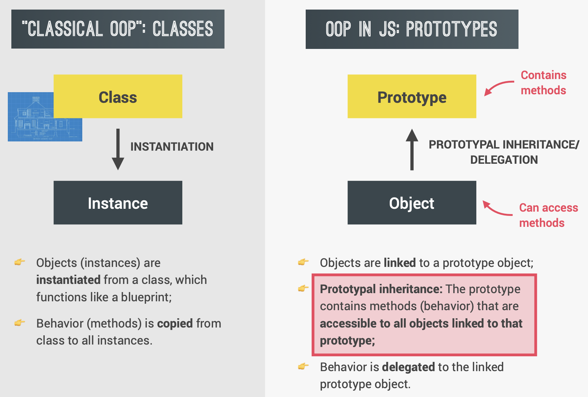
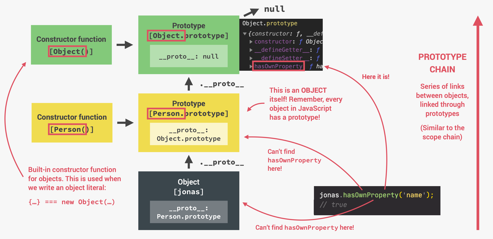

# Object Oriented Programming

## OOP in JavaScript



## Three ways of creating prototypes

1. Constructor functions
   - Technique to create objects from a function;
   - This is how **built-in objects** like Arrays, Maps or Sets are actually implemented.
2. ES6 classes
   - Modern alternative to constructor function syntax;
   - "Syntactic sugar": behind the scenes, ES6 classes work exactly like **constructor functions**;
   - ES6 classes do **NOT** behave like classes in "classical OOP".
3. Object.create()
   - The easiest and most straightforward way of linking an object to a prototype object.

> - **Arrow function** cannot work as function constructor because it doesn't have its own `this` keyword.
> - It's good practice to **set methods using prototypes**, for better code performance.

## Constructor functions

```javascript
const Person = function (firstName, birthYear) {
  this.firstName = firstName;
  this.birthYear = birthYear;
};

const jonas = new Person("jonas", 1999);
```

1. Constructor has a `prototype` property, which is an **object**. We **define methods inside that object**.
2. The `prototype` property has a way to point back to the constructor function itself, that is the `constructor` property.

### Prototype chain

Because a prototype is an object, a prototype can have its own prototype! In this case, the prototype of `Person.prototype` is `Object.prototype`.

```javascript
jonas.hasOwnProperty("firstName"); // true
```

The `hasOwnProperty` method is defined in `Object.prototype`, which can be accessed by `Person.prototype`, which can then be accessed by `jonas`.

`Object` is a **supertype** for all objects in JavaScript. `Person` is the supertype for `jonas`, while `jonas` is the **subtype**.

### Clearing my thoughts

1. jonas: **an object with two properties, firstName and birthYear**

```javascript
personFunc {name: 'Jonas', birthYear: 1990}
	birthYear: 1990
	name: "Jonas"
	[[Prototype]]: Object
		constructor: ƒ personFunc(name, birthYear)
		[[Prototype]]: Object
```

- properties of `jonas`:

```javascript
console.log(Object.keys(jonas));

// Output:
(2)[("name", "birthYear")];
```

- prototype of `jonas`: an **object** with the **only** property `constructor` that points back to the function itself.

```javascript
console.log(jonas.__proto__); // === Person.prototype
console.log(Object.keys(jonas.__proto__));
console.log(Object.getOwnPropertyNames(jonas.__proto__));
```

Output:

```javascript
{constructor: ƒ}
	constructor: ƒ personFunc(name, birthYear)
	[[Prototype]]: Object
		constructor: ƒ Object()
		hasOwnProperty: ƒ hasOwnProperty()
		isPrototypeOf: ƒ isPrototypeOf()
		--snip--

[] // Empty array

['constructor']  // One method
```

- constructor of jonas: the constructor function `Person`

```javascript
jonas.constructor === Person; // true
console.log(typeof jonas.constructor); // function
```

2. Person

`Person` is a **function**, it has a `prototype` property which is an object.

- content of `Person`:

```javascript
ƒ personFunc(name, birthYear) {
     this.name = name;
     this.birthYear = birthYear;
}
```

- `__proto__` of `Person`:

```javascript
Person.__proto__ === Function.prototype; // true
Person.__proto__.constructor === Function; // true
```

- constructor of `Person`:

```javascript
Person.constructor === Function; // true
```

- constructor of `Person.prototype` refers back to itself:

```javascript
Person.prototype.constructor === Person; // true
```

3. `Person.prototype` / `jonas.__proto__`

- prototype: the `prototype` property of `Object`

```javascript
Person.prototype.__proto__ === Object.prototype; // true
```

- constructor:

```javascript
Person.prototype.__proto__.constructor === Object; // true
```



#### Prototype of arrays

Whenever we create a new array, it is actually created by the `Array` constructor function:

```javascript
const arr = [2, 4, 5]; // Same as: const arr = new Array([2, 4, 5]);
arr.__proto__ === Array.prototype; // True
arr.__proto__.constructor; // ƒ Array() { [native code] }
```

`Array` is actually a constructor function with a `prototype` property. `Array.prototype` is an object with no key and 36 methods.

To list the methods in `Array.prototype`:

```javascript
console.log(Object.getOwnPropertyNames(arr.__proto__));

// Output:
(36) ['length', 'constructor', 'concat', 'copyWithin', 'fill', 'find', 'findIndex', 'lastIndexOf', 'pop', 'push', 'reverse', 'shift', 'unshift', 'slice', ......]
```

We can add our own methods to `Array.prototype` so that every array can use this method (`this` keyword will be the array on which the method is called):

```javascript
Array.prototype.unique = function () {
  return [...new Set(this)];
};
const newArr = [3, 5, 6, 4, 3, 6, 7];
console.log(newArr.unique()); // Output: (5) [3, 5, 6, 4, 7]
```

The prototype of `Array.prototype` (an object, a property of Array) is the prototype property of `Object`.

```javascript
console.log(arr.__proto__.__proto__ === Object.prototype); // true
onsole.log(Object); // ƒ Object() { [native code] }
console.log(arr.__proto__.__proto__.constructor); // ƒ Object() { [native code] }
```

The 12 methods contained in `Object.prototype`:

```javascript
Object.getOwnPropertyNames(Array.prototype.__proto__);
// Output:
(12) ['constructor', '__defineGetter__', '__defineSetter__', 'hasOwnProperty', '__lookupGetter__', '__lookupSetter__', 'isPrototypeOf', 'propertyIsEnumerable', 'toString', ......]
```

#### Prototype of DOM elements

```javascript
const h1 = document.querySelector("h1");
console.dir(h1);
```

### Properties && methods

#### `instanceof` operator

```javascript
// Syntax
object instanceof constructor;
```

The `instanceof` operator tests the presence of `constructor.prototype` in object's prototype chain.

```javascript
jonas instanceof Person; // true
jonas instanceof Object; // true
```

#### `isPrototypeOf()` method

The `isPrototypeOf()` method checks if an object exists in another object's prototype chain.

```javascript
Person.prototype.isPrototypeOf(jonas); // true
Object.prototype.isPrototypeOf(jonas); // true
```

#### `__proto__` / `getPrototypeOf()` method

This method `__proto__`(depricated) / `Object.getPrototypeOf()` returns the prototype (i.e. the value of the internal `[[Prototype]]` property) of the specified object.

```javascript
jonas.__proto__ === Person.prototype; // true
```

The _prototyte of of `jonas` object_ is actually the _prorotype **property** of the constructor function_. `Person.prototype` here is actually not the prototype of `Person`, but instead it's gonna be used as the prototype of all objects created with the `Person` constructor function.

#### Prototype properties

Properties in the **prototype** are shared among ALL instances of `Person`. Here's how to add `numLegs` to the `Person` prototype:

```javascript
Person.prototype.numLegs = 2;
```

Now all instances of `Person` have the `numLegs` property.

To set multiple _protoptype_ properties more efficiently:

```javascript
Person.prototype = {
  numLegs: 2,
  calAge() {
    console.log(2030 - this.birthYear);
  },
};
```

#### Own properties

`firstName` and `birthYear` are called **own properties**, because they are defined directly on the instance object. That means every instance of `Person` will have its own copy of these properties.

To check whether a property is the object's own property, we can use `jonas.hasOwnProperty('firstName')`:

```javascript
jonas.hasOwnProperty("firstName"); // true
jonas.hasOwnProperty("numLegs"); // false
```

#### Constructor property

The constructor property returns a reference to the Object **constructor function** that created the instance object.

> Since the constructor property can be overwritten, it’s generally better to use the `instanceof` method to check the type of an object.

There is one crucial side effect of manually setting the prototype to a new object. It _erases the constructor property_!

```javascript
// After making changes to Person.prototype
jonas.constructor === Person; // false
jonas.constructor === Object; // true
jonas instanceof Person; // true
```

To fix this, whenever a prototype is manually set to a new object, remember to **define the constructor property**:

```javascript
Person.prototype = {
  constructor: Person,
  numLegs: 2,
  calAge() {
    console.log(2030 - this.birthYear);
  },
};

jonas.constructor === Person; // true
```

#### Privacy

When discussing privacy in objects, we define it as the idea that only certain properties should be mutable or able to change in value.

Certain languages have privacy built-in for objects, but JavaScript does not have this feature. Rather, JavaScript developers follow naming conventions that signal to other developers how to interact with a property. One common convention is to place an underscore `_` before the name of a property to mean that the property should not be altered, such as `_amount: 1000;`.

##### Getter method

Getters are methods that get and return the internal properties of an object:

```javascript
const person = {
  _firstName: "John",
  _lastName: "Doe",
  get fullName() {
    if (this._firstName && this._lastName) {
      return `${this._firstName} ${this._lastName}`;
    } else {
      return "Missing a first name or a last name.";
    }
  },
};

// To call the getter method:
person.fullName; // 'John Doe'
```

##### Setter method

Along with getter methods, we can also create setter methods which reassign values of existing properties within an object:

```javascript
const person = {
  _age: 37,
  set age(newAge) {
    if (typeof newAge === "number") {
      this._age = newAge;
    } else {
      console.log("You must assign a number to age");
    }
  },
};

// to use the setter method like a property
person.age = 40;
console.log(person._age); // Logs: 40
person.age = "40"; // Logs: You must assign a number to age
```

##### Use getter and setter to validate value

```javascript
class PersonCL {
  constructor(fullName, birthYear) {
    this.fullName = fullName;
    this.birthYear = birthYear;
  }

  set fullName(name) {
    if (name.includes(" ")) {
      this._fullName = name;
      // To set a property that aleready exists, add an underscore
    } else {
      alert(`${name} is not a full name!`);
    }
  }

  get fullName() {
    return this._fullName;
  }
}

const jonas = new PersonCL("Jonas L", 1999);
```

Here, the constructor function is **calling setter function**!

```javascript
jonas; // PersonCL {_fullName: 'Jonas L', birthYear: 1999}
Object.keys(jonas); // (2) ['_fullName', 'birthYear']
```

#### Static methods

Static methods are not inherited, they are not in the prototype of the object.

To add static method to constructor function:

```javascript
PersonCL.hey() = {
	console.log('hey');
}
// Static method, can only be used in the PersonCL namespace

PersonCL.prototype.newFunction() = {
	// .......
}
// Not static method, it can be inherited
```

To add static methods to classes, use `static` keyword:

```javascript
// Static method
static hey() {
	// ...
}
```

## ES6 classes

ES6 provides a new syntax to create objects, using the **class** keyword.

It should be noted that the class syntax is just syntax, and **not** a full-fledged class-based implementation of an **object-oriented paradigm**, unlike in languages such as Java, Python, Ruby, etc.

```javascript
// Class Declaration
class PersonCL {
    constructor(firstName, birthYear) {
        this.firstName = firstName;
        this.birthYear = birthYear;
    }

    calAge() {
        console.log(2030 - this.birthYear);
    }

    introSelf() {
        console.log(`Hi, I'm ${firstName}`);
    }
}

const jonas = new PersonCL('jonas', 1999);

// Class Expression
const PersonCL = class {
	......
};
```

1. It should be noted that the class keyword declares a new **function**, to which a constructor is added. This `constructor` is invoked when new is called to create a new object.
2. **UpperCamelCase** should be used by convention for ES6 class names.
3. All the methods that we write in the class **outside of the constructor** will be on the **prototype of the objects**, and not on the objects themselves. Notice that there are **NO COMMAS** between these methods.

> 1. Classes are NOT hoisted.
> 2. Classes are first-class citizens. (can pass them into functions and return them from functions, because classes are really just a special kind of function behind the scenes)
> 3. Classes are executed in strict mode.

## Object.create

We can manually set the prototype of an object to any other object we want. `Object.create(obj)` creates a new object, and sets `obj` _as the new object's prototype_:

```javascript
const PersonPro = {
  calcAge() {
    console.log(2030 - this.birthYear);
  },

  init(firstName, birthYear) {
    this.firstName = firstName;
    this.birthYear = birthYear;
  },
};

const jonas = Object.create(PersonPro);
jonas.init("jonas", 1998);
```

First, we create a `PersonPro` prototype and give it `calcAge` method, `jonas.__proto__ === PersonPro`.

[More info about prototypal inheritance](Inheritance.md)
