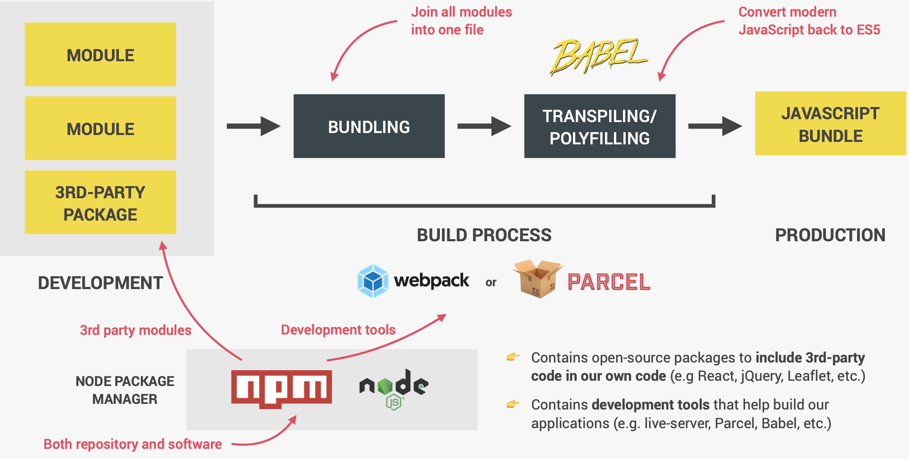

# npm (Node Package Manager)

NPM is both the repository in which packages live and a program that we use on our computers to install and manage these packages.


1. Development Process
   We divide our projects into multiple modules and these modules can share data between them and make our code more organized and maintainable.
   We can also include **3rd-party modules** into our own code. There are thousands of _open source modules_ which we also call **packages**, like React framework or jQuery that developers share on the NPM repository, and we can then use these packages for free in our own code.
   All these packages are available through **npm**.

2. Build Process
   (1) Bundling: bundle all our modules together into one big file. This process can eliminate unused code and compres our code as well.
   Two reasons for bundling:

- Older browsers don't support modules, so code in a module cannot be executed by any older browser.
- It's better for performance to send less files to the browser.
  (2) Transpiling and polyfilling: convert all modern JavaScript syntax and features back to old ES5 syntax. It's usually done using a tool called **Babel**.

We end up with the final JavaScript bundle ready to be deployed on a server for production. Build tools such as **webpack** and **parcel** are used to implement this build process.

3. Production Process

## How to use npm

In each project in which we want to use NPM, we need to start by initializing it with `npm init` in order to create a `package.json` file.

`npm install packageName` or `npm i packageName` to install a package. The package name will show in the `dependencies` in `package.json`, and a folder named `node_modules` will be added to the current folder. Our library is installed in this `node_modules` folder.

If we want to use the library, we need to use a **module bundler** because the library uses commonJS module system.

### Using npm to install lodash

To install lodash, we can use lodash-es version, which uses ES modules instead of commonJS modules.
There is a `cloneDeep` function in lodash which is very handy for creating a deep clone. `Object.assign()` can only copy property values. If the source value is a reference to an object, it only copies the reference value..

```javascript
import cloneDeep from "./node_modules/lodash-es/cloneDeep";
const myObj = {
  state: { empty: false },
  apple: 2,
  banana: 4,
};
const cp1 = Object.assign({}, myObj);
const cp2 = cloneDeep(myObj);

myObj.state.empty = true;
console.log(myObj.state.empty);
console.log(cp1.state.empty);
console.log(cp2.state.empty);

// Output:
// true
// true
// false
```

Actually, when importing the module, we can simply **import it from the library** (we don't need to specify the path):

```javascript
import { cloneDeep } from "lodash-es";
```

### Don't include the `npm_modules` folder when copying your project

When we don't have the folder, use `npm install` or `npm i` to reach into `package.json` file, look at all the dependencies and install them back .

### Installing parcel

Write `npm i parcel --save-dev` or `npm i parcel -D` because parcel is a devDependency.

#### Running locally installed packages:

1. We cannot use parcel directly with `parcel index.html` because it is only installed locally. Instead, we can use `npx parcel index.html` to bundle the modules together. This will create a folder `dist`,distribution, because this is the folder that will be sent for production.
2. We can also write directly in the npm script`package.json`:

```json
 "scripts": {
    "start": "parcel index.html",
    "build": "parcel build index.html"
  },
```

(1) Here, we change the contents of `scripts` manually in the file. Then in terminal, use `npm run start` to run the command. `start` is the name of the npm script that we defined here. This command can be used whenever we want to start parcel or start developing.
(2) When we are done developing, to build the final bundle, `npm run build`.

#### Hot module replacement:

```javascript
if (module.hot) {
  module.hot.accept();
}
```

Whenever we change one of the modules, it will then trigger a rebuild, but that new modified bundle will then automatically get injected into the browser without triggering a whole page reload.

### Install packages globally

`npm i parcel -g` to install packages globally. Then we can use the global tools directly in the command line without the intermediate step of an npm script. However, most of these tools actually _advise developers to always install the tools locally_ so that they can always stay on the latest version.

## Polyfilling

We need to install `npm i core-js` and `npm i regenerator-runtime`(for async functions)

```javascript
import "core-js/stable";
```

==Note:==
`ctrl + c` to exit the current terminal.
